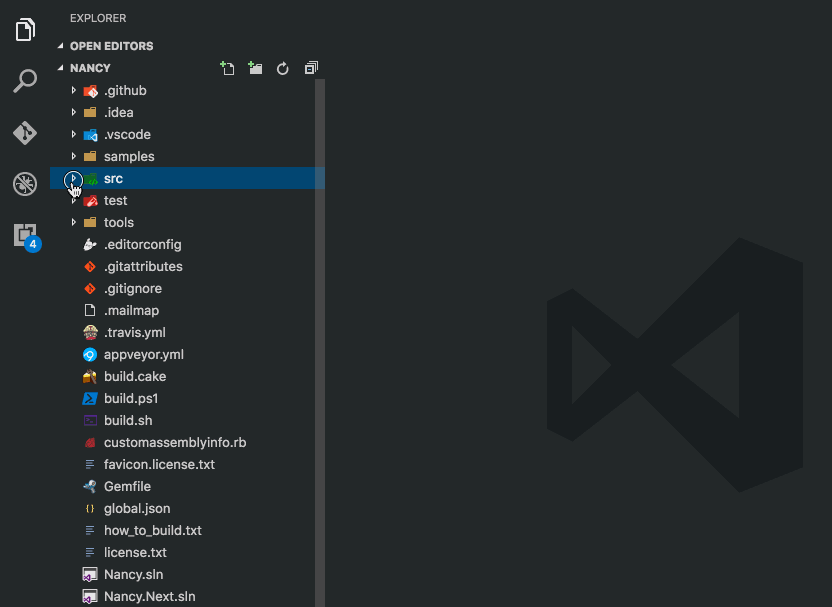
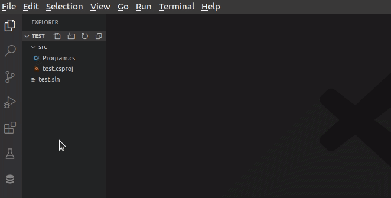
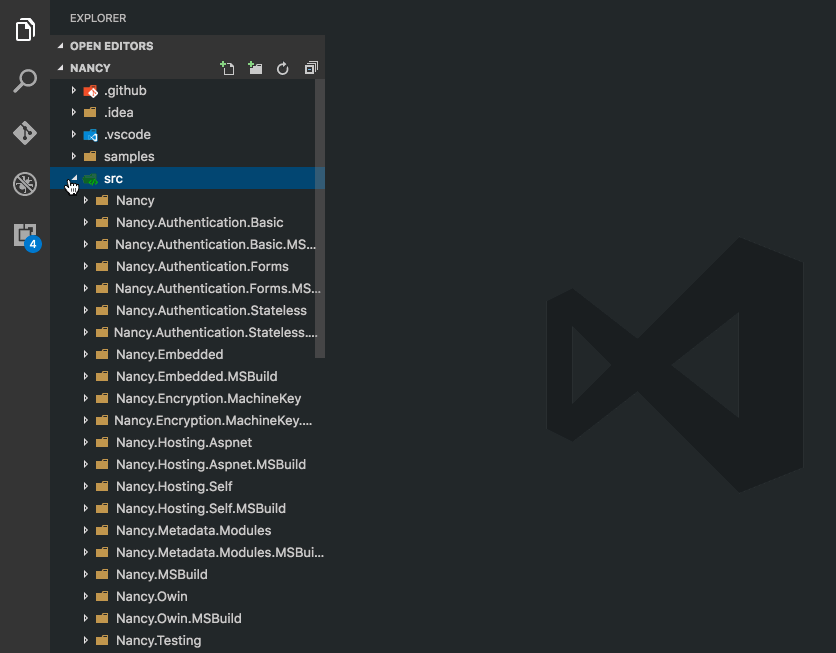
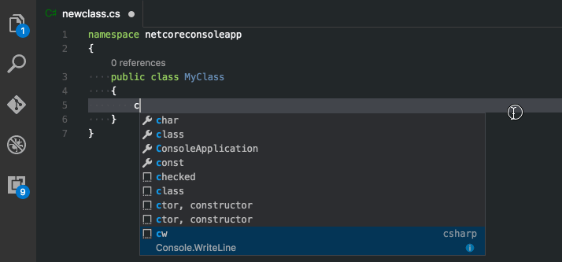
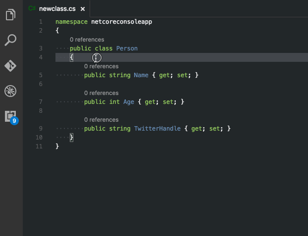
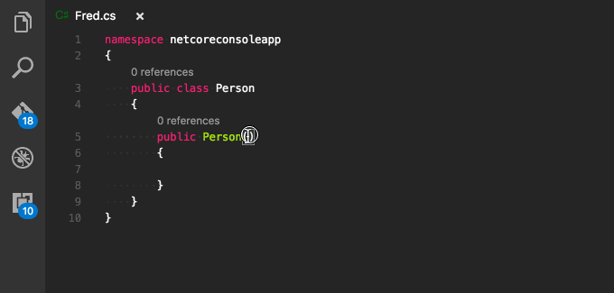
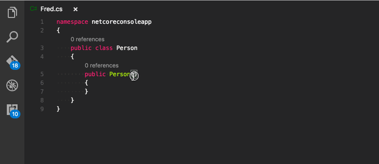

# Customized version of https://github.com/jchannon/csharpextensions, -> https://github.com/KreativJos/csharpextensions

# C# Extensions

Welcome to C# Extensions.  This VSCode extension provides extensions to the IDE that will hopefully speed up your development workflow.
It can currently be found at:
- [VS Code Marketplace](https://marketplace.visualstudio.com/items?itemName=kreativ-software.csharpextensions)
- [Open VSX](https://open-vsx.org/extension/jsw/csharpextensions).

## Features

**Add C# Class**

**Add C# Enum**

**Add C# Interface**

**Add fields from constructors**

**Add constructor from properties**

**Add read-only property from constructors**

**Add property from constructors**

This extension traverses up the folder tree to find the project.json or *.csproj and uses that as the parent folder to determine namespaces.

-----------------------------------------------------------------------------------------------------------

## Licence

MIT

See [licence.txt](./licence.txt)
Legacy Repository: [jchannon/csharpextensions](https://github.com/jchannon/csharpextensions)
